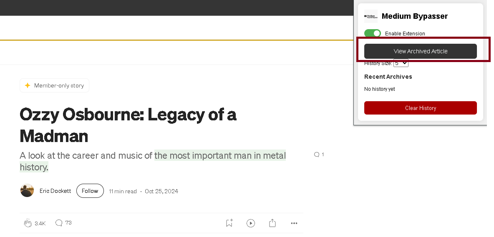
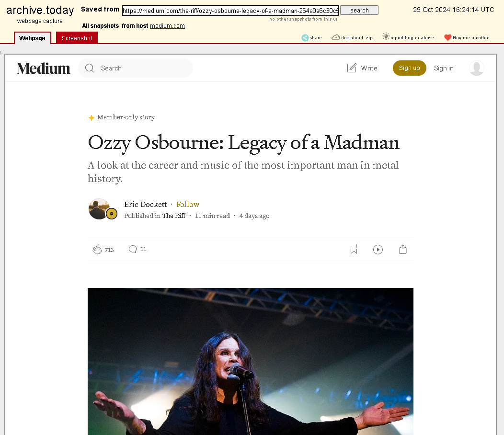
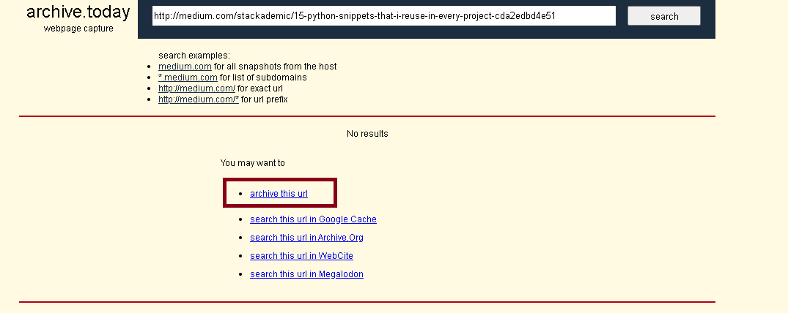

# Medium.com Paywall Bypasser

**This Chrome extension automatically redirects Medium articles to archived versions on archive.is, allowing users to bypass paywalls and read the full content without logging in or subscribing. Originally, this was meant to work on nknews.org, but that was deprecated. For more info, see: https://github.com/zach-kidwell/ArticleArchiver**

---

## Features

- **Automatically redirects** Medium.com paywalled articles to archive.is  
- **Button** to manually view an archived version of the current page  
- **Keeps a history** of the most recent articles you've archived  
- **Option** to clear history  
- **Toggle** the extension on or off from the popup  
- **Badge updates** to show whether the extension is currently enabled  
- **User configurable** number of articles to save in history  

---

## How it works

When the extension is enabled, it looks for paywalled Medium articles and redirects to an archived version. It also gives you a button to manually archive the page you're on. The extension saves a list of the most recent archived links and displays them in the popup. You can clear the history if you want to start fresh. You can also choose how many links to keep in the history.

---

## How to use

1. **Clone or download** this repo  
2. Go to `chrome://extensions` and **turn on Developer Mode**  
3. Click **"Load unpacked"** and select the folder  
4. Visit any Medium article. If it's paywalled, click **"View Archived Article"** or it may automatically redirect depending on your version  

---

## Why I made this

Medium puts a lot of content behind a paywall, and I wanted a quick way to access articles without logging in or hitting limits. This project was also a good way to learn more about Chrome extensions, background scripts, DOM parsing, and local storage.

---

## Notes

This extension does **not** archive the page itself, it just redirects to an archived version if one exists (or lets you open it manually). It uses archive.is since it's reliable and doesn’t require an account. If you click **View Archived Article** and there is not an archive already, you can click **archive this url**. After archiving, repeat the process and you will be able to view the archived article.

